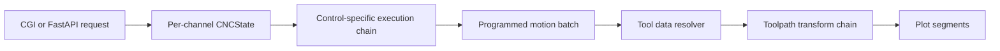

# Tool Compensation Execution and Geometry Plan

This plan separates control-specific command interpretation from shared
toolpath geometry. The existing linear, circular, cycle, feed, and duration
calculations remain the source of programmed motion.

## Scope and terminology

- `effective` path: the programmed contour currently produced by the engine.
- `center` path: a compensated tool reference path. FANUC mill and Siemens
  ISO `G41/G42` polyline compensation is implemented; turning nose and TCP
  stages remain pending.
- Cutter radius compensation: `G40`, `G41`, and `G42` for milling.
- Tool nose radius compensation: `G40`, `G41`, and `G42` for turning. This
  also requires the tool-tip orientation/quadrant.
- Tool length compensation: `G43`, `G44`, and `G49`. This is not radius
  compensation.
- Dynamic TCP compensation: commands such as `G43.4` and `G43.5`. These
  require tool length, orientation, pivot data, and machine kinematics.

## Current data path

The CGI already stores frontend `toolValues` in each independent channel
state:

```text
machinedata[].toolValues
  -> CNCState.extra["tool_compensation_data"]
  -> FanucToolHandler / SiemensToolHandler
  -> active tool in CNCState
  -> movement snapshot toolNumber
```

Current `rValue` and `qValue` are sufficient to start 2D milling radius and
turning nose compensation. Optional `lengthValue` and `edgeNumber` values are
preserved when supplied, but they do not change geometry yet. TCP must remain
unsupported until its required tool and machine kinematic data are available.

## Target architecture

Use two chains with different responsibilities:

1. The existing execution chain parses commands, updates modal/tool state,
   and generates programmed motion.
2. A shared toolpath transform chain converts programmed motion to the
   requested output representation.



The transform chain belongs at the output boundary of `BaseStatefulCanal`,
after a node has generated ordinary or cycle motion and before that motion is
stored in `_tool_path`. This location handles all geometry producers instead
of only calls that reach `MotionHandler`.

Do not put the vector algorithm directly in `MotionHandler`. A handler placed
immediately before `motion` could post-process ordinary motion on the return
path, but it would miss cycle handlers that return generated segments early.

## FANUC execution chain

The exact middle handlers remain machine-profile driven. The important order
is tool selection before compensation commands, and compensation state before
geometry generation.

```mermaid
flowchart LR
    Parse[Fanuc parser] --> Flow[Variables and flow]
    Flow --> Tool[Fanuc or Star tool handler]
    Tool --> Validate[Precheck and G-code groups]
    Validate --> Modal[Plane, units, feed, modal state]
    Modal --> CompCmd[Fanuc compensation command handler]
    CompCmd --> Cycles[Turning and drilling cycle handlers]
    Cycles --> Motion[MotionHandler]
    Motion --> Batch[Programmed motion batch]
    Batch --> Project[Shared toolpath transform chain]
```



Add these control-specific command handlers as required:

- `FanucCutterCompCommandHandler` for mill `G40/G41/G42` and `D`.
- `FanucToolNoseCompCommandHandler` for turn/Star `G40/G41/G42`, radius,
  and tool-tip orientation.
- `FanucToolLengthCommandHandler` for `G43/G44/G49` and `H`.
- `FanucTcpCommandHandler` for `G43.4/G43.5` only when a machine kinematics
  adapter is available.

These handlers only validate commands and update compensation state. They do
not create or alter points.

## Siemens execution chain

```mermaid
flowchart LR
    Parse[Siemens parser] --> Scope[Variables, flow, frames]
    Scope --> Transform[Siemens transformations and modes]
    Transform --> Tool[Siemens tool handler]
    Tool --> CompCmd[Siemens compensation command handlers]
    CompCmd --> Cycles[Siemens cycle handlers]
    Cycles --> SiemensMotion[SiemensMotionHandler]
    SiemensMotion --> Motion[MotionHandler]
    Motion --> Batch[Programmed motion batch]
    Batch --> Project[Shared toolpath transform chain]
```



Keep Siemens command syntax and offset-register lookup in Siemens handlers,
but use the same geometry projectors as FANUC. The existing
`SiemensISOCutterCompHandler` should become a state-only command handler; its
radius lookup should move to the shared tool data resolver.

## Domain model

Add typed state instead of adding algorithm switches to `machines.json`:

```python
@dataclass
class ActiveToolGeometry:
    tool_id: int | str | None = None
    radius: float | None = None
    nose_radius: float | None = None
    tip_orientation: int | None = None
    length: float | None = None
    edge: int | None = None


@dataclass
class CompensationState:
    radius_mode: str = "OFF"       # OFF, LEFT, RIGHT
    length_mode: str = "OFF"       # OFF, POSITIVE, NEGATIVE, TCP
    radius_register: int | None = None
    length_register: int | None = None
    activation_line: int | None = None
```

Each `CNCState` owns its own instances, preserving channel independence.
Tool handlers set active tool identity. A `ToolDataResolver` combines that
identity with `tool_compensation_data` when compensation is activated or a
movement is projected.

The resolver must distinguish:

- unknown active tool;
- known tool without required radius/length data;
- known tool and valid compensation geometry.

Missing required data should produce a structured NC error. It must never
silently use tool 1 or a zero radius.

## Motion batch boundary

Introduce an internal result type while preserving the public plot response:

```python
@dataclass
class MotionPrimitive:
    points: list[Point]
    duration: float
    geometry: str | None
    traversal: str | None
    source_code: str | None


@dataclass
class MotionBatch:
    primitives: list[MotionPrimitive]
    line_number: int | None
    execution_step: int
    tool_number: int | str
```

Initially, `BaseStatefulCanal` can adapt existing `(points, duration)` returns
and `generated_motion_segments` into `MotionBatch`. This avoids changing the
interpolation formulas or all cycle handlers at once.

## Toolpath transform chain

Recommended order:

```text
Programmed motion
  -> ToolSnapshotStage
  -> ToolLengthStage
  -> RadiusOrNoseCompensationStage
  -> TcpKinematicsStage
  -> Existing rotary/plot transform
  -> API serialization
```

Only enabled stages modify points. In `effective` mode, the radius/nose stage
is an identity transform so existing output remains unchanged.

The existing final `_transform_points_for_plot()` call should eventually move
from the motion handlers into the last transform stage. This changes where the
already-calculated points are transformed, not how interpolation is computed.
It is necessary for correct compensation in workpiece coordinates before
rotary machine transforms are applied.

## Vector compensation algorithm

### Milling G41/G42

For a 2D segment in the active plane with unit tangent
`t = (du, dv) / length`, its left unit normal is:

```text
n_left = (-t.v, t.u)
n_right = (t.v, -t.u)
offset = radius * selected_normal
```

Apply the offset in the active `G17/G18/G19` plane and retain the third-axis
coordinate. Use internal radius coordinates after diameter normalization.

Do not offset blocks independently. Buffer one movement so adjacent offset
segments can be joined:

- intersect adjacent offset lines at ordinary corners;
- trim inside corners;
- use a bounded miter or inserted transition arc at outside corners;
- reject or diagnose gouging and zero-length lead-in/lead-out moves;
- flush the buffered segment on `G40`, program end, channel end, or error.

The first implementation may offset the existing tessellated polyline. Keep
the chord tolerance explicit. A later analytic implementation can preserve arc
centers and alter arc radius directly for higher precision.

### Turning tool nose compensation

Use the same plane-vector kernel in the active turning plane, normally `G18`
(`X/Z`), but add a turning policy that maps:

- `G41/G42` to the compensated side;
- nose radius to offset magnitude;
- `qValue`/tip orientation to the theoretical tip-to-nose-center reference;
- diameter-programmed X to internal radius coordinates before offsetting.

The shared vector kernel must not interpret quadrant numbers. That mapping is
control/machine policy owned by `FanucToolNoseCompCommandHandler` and passed
to the projector as a resolved vector.

### G43/G44/G49

Implement tool length as a separate vector along the active tool axis:

- `G43`: positive tool-axis offset;
- `G44`: negative tool-axis offset;
- `G49`: cancel length offset.

For a fixed three-axis mill, the default tool axis is Z. Do not combine this
value with cutter radius or nose radius.

### G43.4/G43.5 and TCP

Do not implement these as a simple XYZ offset. Accurate TCP output requires:

- tool length;
- commanded tool orientation;
- rotary centers and axis order;
- machine/head/table kinematic model;
- control-specific TCP semantics.

Until a kinematics adapter exists, parse and record the mode but return a
clear unsupported/insufficient-configuration diagnostic when `center` output
requires TCP. Do not claim accurate center coordinates.

## API data

Keep the current request shape for radius work:

```json
{
  "toolPathMode": "center",
  "machinedata": [{
    "toolValues": [
      {
        "toolNumber": 1,
        "qValue": 3,
        "rValue": 0.4,
        "lengthValue": 120.5,
        "edgeNumber": 1
      }
    ]
  }]
}
```

`lengthValue` and `edgeNumber` are optional. The CGI preserves them in the
per-channel tool data when supplied. Current radius compensation continues to
use `rValue` and `qValue`; length/TCP behavior must not be claimed until its
geometry stages are implemented.

Geometry and material definitions remain frontend snapshot data and do not
need to be repeated on every segment. Segment responses retain `toolNumber`,
`lineNumber`, and `executionStep`.

## Implementation phases

### Phase 1: state and identity

1. Add typed active-tool geometry and compensation state to `CNCState`.
2. Add `ToolDataResolver` with numeric and named tool tests.
3. Convert Siemens cutter compensation to state-only behavior.
4. Add equivalent FANUC mill and turn command handlers.
5. Preserve existing effective-path output exactly.

### Phase 2: common output pipeline

1. Adapt ordinary and generated cycle paths into `MotionBatch`.
2. Add a per-channel toolpath transform chain in `BaseStatefulCanal`.
3. Move final plot/rotary transformation to the last stage.
4. Verify no coordinate or timing changes in `effective` mode.

### Phase 3: 2D milling radius compensation

1. Implement active-plane line offset.
2. Add one-movement look-ahead and corner joins.
3. Support tessellated arcs with explicit tolerance.
4. Implement lead-in, lead-out, `G40`, and gouge diagnostics.
5. Enable the shared stage for both FANUC mill and Siemens ISO mode.

### Phase 4: turning nose compensation

1. Add Q/tip-orientation policy and X diameter-mode tests.
2. Reuse the vector offset and corner kernel in the X/Z plane.
3. Cover line-line, line-arc, arc-line, and arc-arc transitions.
4. Add Star restrictions and independent multichannel state tests.

### Phase 5: length and TCP

1. Replace the simplified Z-only length behavior with tool-axis vectors.
2. Implement `G43/G44/G49` for fixed-axis machines.
3. Define a machine kinematics adapter interface.
4. Implement `G43.4/G43.5` only for configured kinematic models.

## Required tests

- `effective` mode remains coordinate-for-coordinate compatible.
- A straight G41/G42 move offsets by exactly the configured radius.
- G40 flushes the prior compensated segment and cancels later offsets.
- Line-line and line-arc corners are continuous without duplicate points.
- Inside-corner gouging produces a deterministic domain error.
- Generated cycle primitives retain tool, line, and execution-step identity.
- Looped source lines produce distinct execution steps with correct tool
  snapshots.
- Numeric and named Siemens tools resolve compensation data correctly.
- Turning uses internal radius coordinates and all supported Q orientations.
- Channels do not share active tool, buffered corner, or compensation state.
- TCP mode without complete kinematic data reports unsupported configuration.

## Implemented first slice

The first shared projector is connected at the output boundary:

1. Supports FANUC mill and Siemens ISO `G40/G41/G42` in active planes.
2. Read active tool `rValue` through `ToolDataResolver`.
3. Return identity output for `effective` mode.
4. Offset generated polylines and join consecutive paths in `center` mode.
5. Preserve tool number, source line, execution step, and duration metadata.

The current arc result follows the engine's tessellated polyline resolution.
Analytic arc joins, turning tool-nose/Q mapping, interference checks, lead-in
validation, tool-length vectors, and TCP kinematics remain future phases.